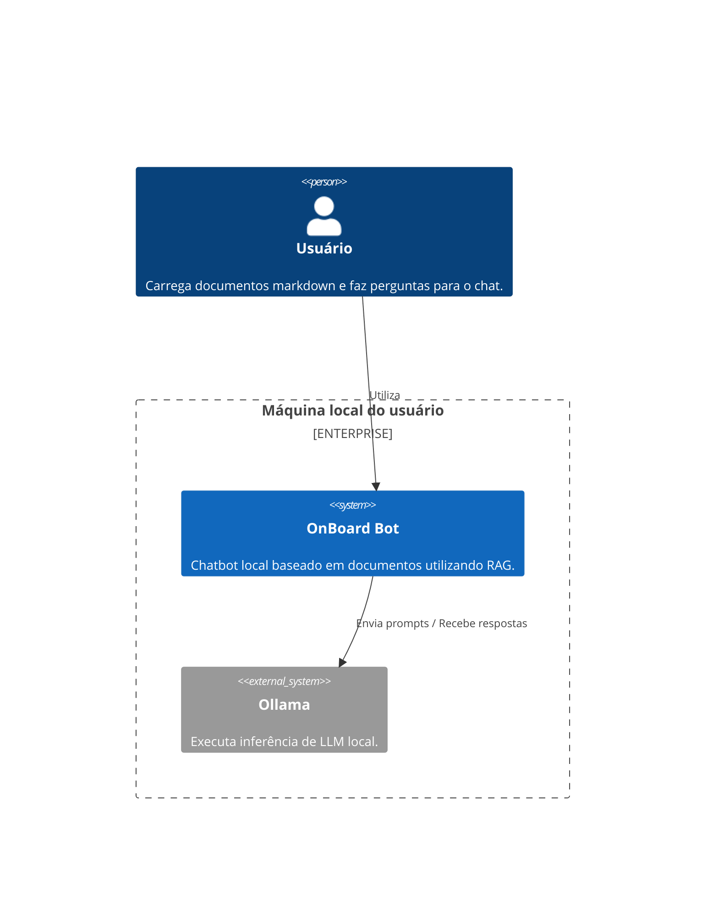
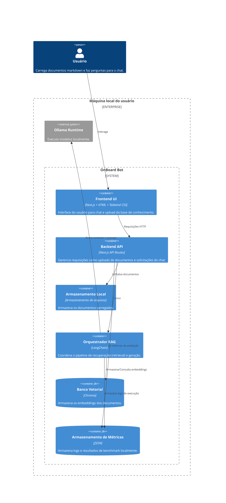
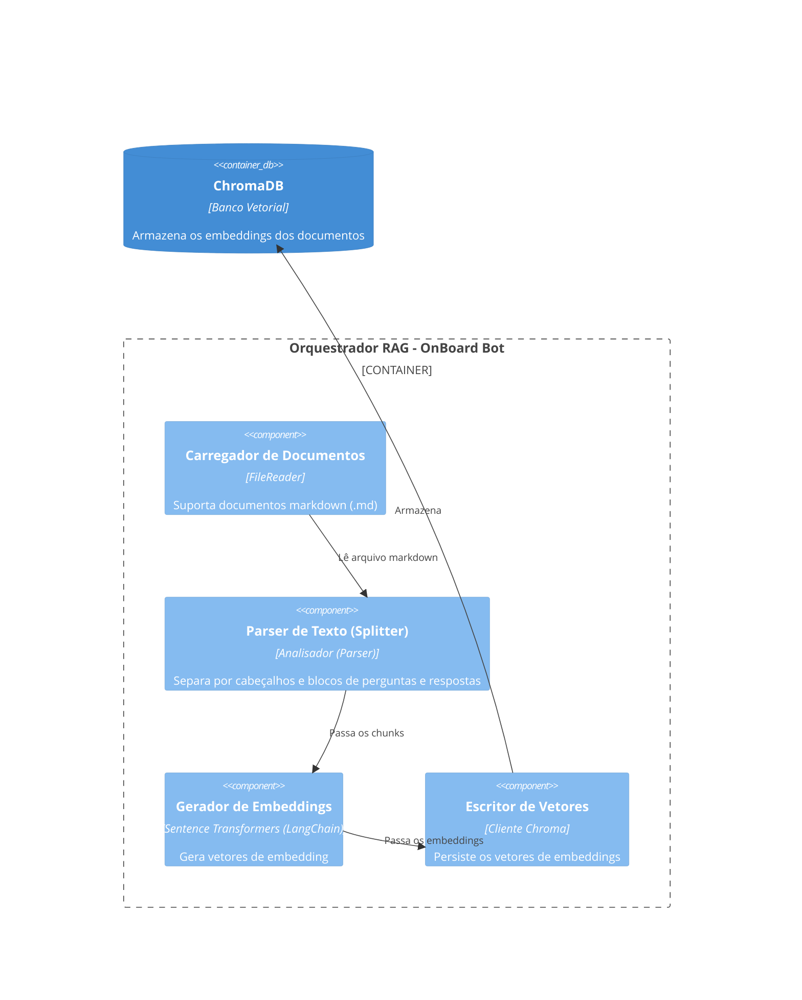
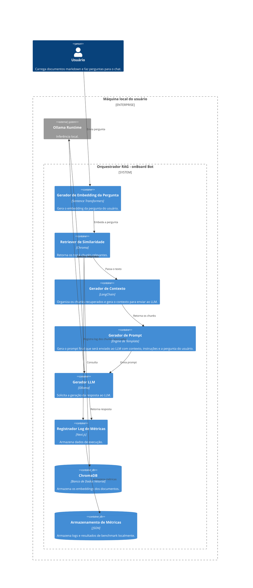
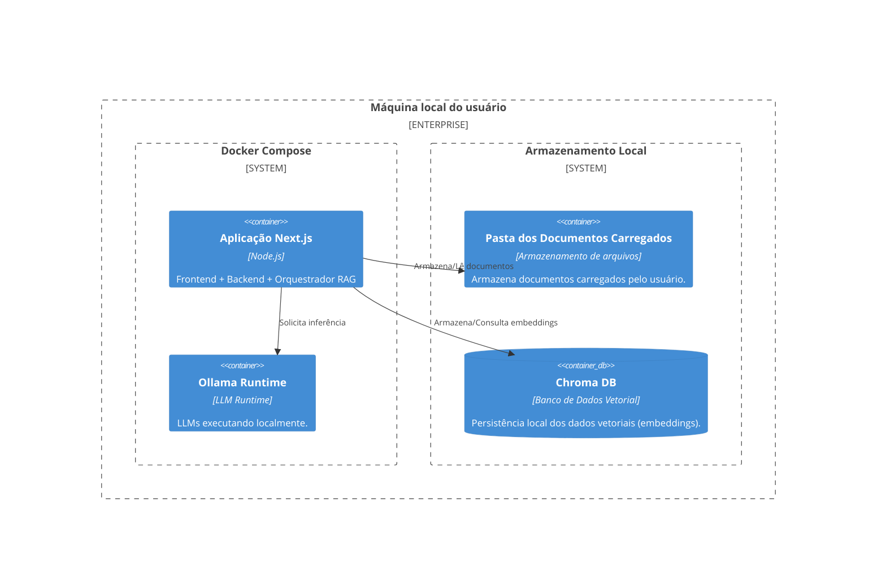

# Diagrama de Arquitetura

A arquitetura da aplicação onBoard Bot foi representada no modelo C4.

## C1 - Contexto - Visão Macro

**Objetivo**: Mostrar quem usa e quais sistemas externos existem.

---

## C2 - Container - Componentes Executáveis

**Objetivo:** Mostrar a arquitetura da aplicação.

---

## C3 - Componente - Lógica Interna de Ingestão

**Objetivo:** Mostrar pipeline de ingestão RAG.

---

## C3 - Componente - Lógica Interna de Pergunta

**Objetivo:** Mostrar pipeline de pergunta/resposta.

---

## C4 - Deployment - Reprodutividade

**Objetivo:** Mostrar execução local da aplicação.

